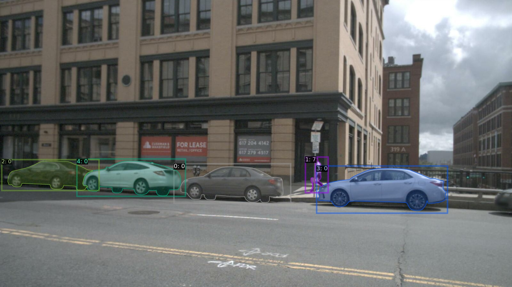

# nuInsSeg
provide comprehensive information for nuInsSeg dataset

## 1.Introduction
Through investigation, we found that although existing large-scale autonomous driving datasets provide multi-modal data, they lack multi-modal and consistent annotations.
So on the basis of the nuScenes dataset, we supplement the image instance segmentation annotation, and call it nuInsSeg.
As far as we know, this is the first one that contains both: LiDAR point cloud, RGB image,
Open source autonomous driving datasets with manual 2D annotations (2D detection boxes, 2D instance segmentation), 3D annotations (3D detection boxes...), and these 2D and 3D annotations have instance-level consistency.
Added 947,072 2D annotations (box detection and instance segmentation) to the 204,894 images in the nuScenes-trainval data.

It is hoped that nuInsSeg can help researchers to better study large-scale autonomous driving scenarios, especially from the perspective of multimodal sensor fusion.

## 2.Statistics
The nuScenes training and validation dataset contains 1,166,187 3D detection box annotations, but because many objects are occluded or unclear in the camera's line of sight, the corresponding 2D annotations will be less.
The following are the data statistics of the nuInsSeg data training set and validation set, and the target category is consistent with the nuScenes detection task.

### nuInsSeg taining set class distribution

|category|car|bus|motorcycle|barrier|truck|const.veh|pedestrain|trailer|bicyle|traff.cone|total|
|:--------:|:--------:|:--------:|:--------:|:--------:|:--------:|:--------:|:--------:|:--------:|:--------:|:--------:|:--------:|
|instances|357006|12917|7483|103028|63532|8413|143857|14824|7241|70892|789193|

### nuInsSeg validation set class distribution

|category|car|bus|motorcycle|barrier|truck|const.veh|pedestrain|trailer|bicyle|traff.cone|total|
|:--------:|:--------:|:--------:|:--------:|:--------:|:--------:|:--------:|:--------:|:--------:|:--------:|:--------:|:--------:|
|instances|68578|3084|1934|21964|14179|1836|27778|2695|1942|13889|157879|

## 3.Benchmark
Here we provide the benchmark for instance segmentation and Weakly supervised instance segmentation on nuInsSeg dataset.
The category of instance segmentation is the same as [nuScenes detection tasks](https://www.nuscenes.org/object-detection?externalData=all&mapData=all&modalities=Any).

We adopt a standard evaluation metric of instance segmentation which is the same as that used in Mask R-CNN. 
It includes AP (average precision over IoU thresholds), AP50, AP75 and APs, APm,  APl (AP at different scale).
In our experiment, models are implemented using the official codebase without modification.

### Task1: Instance Segmentation

Instance Segmentation aims to recognize distinct instances of objects in an image by predicting pixel-level category and instance identity, which has benefited a wide range of applications such as autonomous driving. Here we provide the results of several compatitable models on nuInsSeg dataset(official code).

|Model|Backbone|Lr_schedule|Mask_AP|Download|Log|
|:--------:|:--------:|:--------:|:--------:|:--------:|:--------:|
|[Mask R-CNN](https://openaccess.thecvf.com/content_ICCV_2017/papers/He_Mask_R-CNN_ICCV_2017_paper.pdf)|R-50|1x |47.55|link|link|
|Mask R-CNN|R-101|1x|49.13|link|link|
|[PointRend](https://openaccess.thecvf.com/content_CVPR_2020/papers/Kirillov_PointRend_Image_Segmentation_As_Rendering_CVPR_2020_paper.pdf)|R-50|1x  |48.03|link|link|
|PointRend|R-101|1x |49.12|link|link|
|[CondInst](https://link.springer.com/chapter/10.1007/978-3-030-58452-8_17)|R-50|1x   |44.88|link|link|
|CondInst|R-101|1x  |46.83|link|link|

R-50 and R-101 is pretrained on imagenet. 'Lr_schedule' means the training iterations and '1x' is 7w iterations.

### Task2: Weakly Supervised Instance Segmentation

Weakly supervised instance segmentation aims to extract objects with simple and cheap annotation such as image-level tags, scribble and bounding box instead of expensive pixel-level annotations.

|Model|Backbone|Annotations|Lr_schedule|Mask_AP|Download|Log|
|:--------:|:--------:|:--------:|:--------:|:--------:|:--------:|:--------:|
|[BoxInst](https://openaccess.thecvf.com/content/CVPR2021/html/Tian_BoxInst_High-Performance_Instance_Segmentation_With_Box_Annotations_CVPR_2021_paper.html)|R-50|box|1x |33.65|link|link|
|BoxInst|R-101|box|1x|34.39|link|link|
|[PointSup](https://arxiv.org/abs/2104.06404)|R-50|box+point|1x  |43.80|link|link|
|PointSup|R-101|box+point|1x |44.72|link|link|
|LWSIS+BoxInst|R-50|3dbox+pc|1x   |35.65|link|link|
|LWSIS+BoxInst|R-101|3dbox+pc|1x  |36,22|link|link|
|LWSIS+PointSup|R-50|3dbox+pc|1x   |45.46|link|link|
|LWSIS+PointSup|R-101|3dbox+pc|1x  |46.17|link|link|

Here we explain different annotations used in the exp. 'box' means only using the 2D bounding box annotation for each instance, 'point' means using a specific number of points with human annotation indicating the background/foreground, '3dbox' means using the 3D bounding box annotations for each instance and 'pc' means the original point cloud.

LWSIS is the method used in our paper "LWSIS: LiDAR-guided Weakly Supervised Instance Segmentation for Autonomous Driving."

## 4.Tutorial
We provide development tookit to access the instance segmentation results easily: [nuInsSeg-devkit](./nuinsseg-devkit/README.md).

## 5.Download
Here we provide the download link of the nuInsSeg dataset.

1. [nuInsSeg]()

2. [nuInsSeg-mini]()

## 6.Acknowledgement
It is stated here that we only add the annotation of instance segmentation on the basis of the nuscenes dataset, in order to better conduct research on multimodal perception for researchers. Many thanks to nuscnes for contributions to open source data.