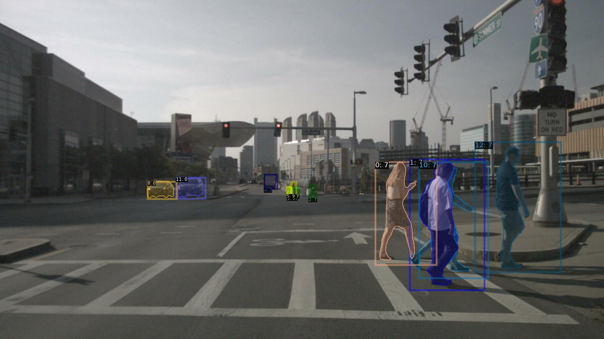

# nuinsseg-devkit
Welcome to the development toolkit for nuInsSeg dataset.

## Devkit setup
- Install nuscenes-devkit by following the steps in [nuscenes-devkit](https://github.com/nutonomy/nuscenes-devkit/blob/master/docs/instructions_nuscenes.md).

-   Clone the nuinsseg-devkit to your project and import:
    ```
    from nuinsseg import NuInsSeg
    ```
## Data preparation
- Download the nuscenes origin datasets. The folder structure shall be like this:
    - nuscenes
        - annotations
        - lidarseg
        - maps
        - samples
        - sweeps
        - v1.0-trainval
        - v1.0-mini
- Download [nuinsseg/nuinsseg.json](https://drive.google.com/file/d/1lU5UUMnTcg-jb6mqQIcdmBiuJdpLkE4F/view?usp=share_link) and put it into the v1.0-trainval folder.
- Download [nuinsseg-mini/nuinsseg.json](https://drive.google.com/file/d/1lU5UUMnTcg-jb6mqQIcdmBiuJdpLkE4F/view?usp=share_link) and put it into the v1.0-mini folder.

## Getting started with nuinsseg devkit
```
jupyter notebook $HOME/nuinsseg-devkit/Tutorial.ipynb
```

## Dataloader
- How to convert nuInsSeg dataset to COCO data format:
    ```
    python nuinsseg_converter.py --data-root datasets/nuscenes --version v1.0-mini --out-dir datasets/nuinsseg/annotations --split train
    ```
    Then the coco format json file can be used to train and evaluate the model directly through pycocotools.
## Known issues

**问题1:部分目标2D标注缺失**
- 原因1:当nuScnes数据集中没有此目标标注时，会造成2D标注的缺失。
(Label any target object containing **at least 1 LIDAR or RADAR point**)。

- 原因2:人工标注结果与原始数据集id部分不匹配，造成标注不可用。

## Acknowlegement
在此申明我们仅在nuscenes数据集的基础上增加了实例分割的标注，为了研究人员更好地进行多模态感知的研究。十分感谢[nuscnes](https://www.nuscenes.org/nuscenes)。